<h2 align="center">📚 [ BookHub ] 📚</h2>

 

> 책을 찾고, 찜하고, 결제하는 모든 과정을 손쉽게!

>BookHub는 사용자에게 다양한 도서 검색, 찜하기, 결제, 상세 정보 제공 등의 기능을 제공하는 종합 도서 쇼핑몰입니다.
>
>간편한 인터페이스와 많은 도서 정보를 통해 사용자들이 원하는 책을 쉽고 빠르게 찾을 수 있습니다.

 

## 🐥 목차
- [⚙ 기술 스택](#기술-스택)
- [🔥 개선 사항](#개선-사항)
- [💻 기능 구현](#기능-구현)
 

## ⚙ 기술 스택 

| 분류       | 기술명                                                        |
|----------|------------------------------------------------------------|
| BackEnd  | Java, Spring Boot, Spring Security, Junit, MySQL , MyBatis |
| FrontEnd | HTML, Javascript, Bootstrap,  Thymeleaf, jQuery, Ajax      |
| DevOps   | CodeDeploy, GithubAction                                   |
| Infra    | AWS EC2, AWS RDS (MySQL 8.0), AWS S3                       |
| Tools    | IntelliJ, Gradle, nGrinder , MobaXterm                     |

 

## 🔥 개선사항  

### AWS EC2 포트포워딩
  - 프로젝트 배포 후 URL에서 :8080 포트제거
    - EC2 보안그룹 설정
    - 포트 리다이렉트 설정 
      -  설정 전 : 15.165.134.135/:8080 
      -  설정 후 : 15.165.134.135

### AWS EC2와 RDS를 활용한 CICD 배포
  - 프로젝트 당시 경험하지 못한 CI/CD 배포방식 적용
    - AWS EC2와 RDS를 사용한 데이터베이스 호스팅 : 로컬 MySQL 대신 AWS RDS를 이용하여 데이터베이스를 호스팅
    - CodeDeploy 사용 : AWS CodeDeploy를 이용하여 배포를 자동화
    - GitHub Actions 설정 : GitHub Actions를 설정하여, 프로젝트를 푸시하면 자동으로 배포되도록 구성

### AWS RDS MySQL로 데이터베이스를 이전
  - 기존 로컬 `MySQL` 데이터베이스를 `AWS RDS MySQL` 로 전환

### Master - Slave DB 간의 `Write/Read` 쿼리 분산 [ [코드](https://github.com/gi-dor/BookHub_AWS/blob/30fcb619ad22758e65fe71214f00f1c8ec493e8e/src/main/java/com/example/bookhub/config/DataSourceConfiguration.java#L16-L62) ]
  - `@Transactional` 의 `readOnly` 속성을 이용한 쿼리 분산 (@Transactional : 스프링 어노테이션)
  - `@RouteDataSource` 의 `dataSourceType` 속성을 이용한 쿼리분산

### 중요정보 암호화 처리 [ [ 코드 ](https://github.com/gi-dor/BookHub_AWS/blob/30fcb619ad22758e65fe71214f00f1c8ec493e8e/src/main/java/com/example/bookhub/config/JasyptConfig.java#L16-L35) / [ BLOG ](https://gi-dor.tistory.com/250) ]
  - DB 접속정보 및 EmailAPI 정보 누출로 인한 보안위험 대응
    - 지난 프로젝트에서 application.properties 에 저장된 DB 연결정보를 GitHub에 push 되어 데이터베이스를 해킹 당한 사례가 있었습니다
      - `application.properties`에 저장된 `DB 연결 정보 와 EmailAPI 접속 정보`를 `jasypt` 암호화를 통한 보안을 강화하였습니다
  

### 회원 가입 완료시 `비동기 이메일 전송` [ [ 코드 ](https://github.com/gi-dor/BookHub_AWS/blob/30fcb619ad22758e65fe71214f00f1c8ec493e8e/src/main/java/com/example/bookhub/config/AsyncConfig.java#L8-L21) / [ BLOG ](https://gi-dor.tistory.com/255) ]
  - 초기에 동기 방식으로 진행했을 때는 회원 가입 완료 후 이메일 전송 및 완료 페이지 표시까지 약 3~5초가 소요되었습니다.
    - 스프링프레임워크에서 제공하는 `@Async` 어노테이션을 사용하여  메서드를 비동기 처리
      - 이메일 전송이 비동기적으로 처리되어 `TPS  :  3231ms → 110ms`  로 줄어들었습니다.
      
        

          
 테스트 결과 동기 비동기 

           
          <strong>[ 동기 ]</strong>
  
          
            
  
          <strong>[ 비동기 ]</strong>
  
          
  
          <strong>[ 성능개선 비교 ]</strong>
  
          
  
          

### 1:1 문의사항 `INDEX 조회성능 개선`   [ [코드](https://github.com/gi-dor/BookHub_AWS/blob/f330f85d60b0ba8639fda9bc610c3df3083a08fc/src/testImg/index/INDEXSQL.sql#L18-L26) / [BLOG](https://gi-dor.tistory.com/252) ]

  - 지속해서 누적되는 데이터로 인해 조회성능이 저하됩니다 이를 개선하기위해  INDEX를 설정하여 성능을 향상 시켰습니다
    - 카디널리티 수치가 높은 컬럼을 기준으로 INDEX 를 설정하였습니다
      - 평균 `TPS : 8.8ms  → 62.5ms` 로 610% 개선
        

        
테스트 결과 INDEX

         
        <strong> INDEX 적용 전 </strong>
    
        
          
    
        <strong>INDEX 적용 후</strong>
    
        
    
        

   

## 💻 기능구현 

  - ### 인증된 사용자에 조건에 맞는 navbar  
    

  - ### 로그인 / 로그아웃
    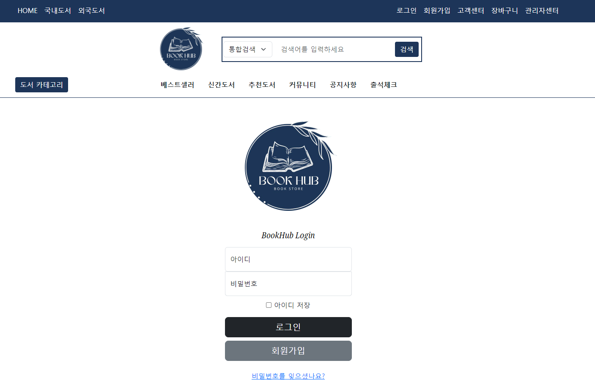

  
- ### 회원가입
  - 정규표현식 , @valid 검증
  - kakao 우편번호 API
  - 아이디 중복 체크
    - aJax 비동기  
    - 중복체크 사용자 예외처리 클래스
  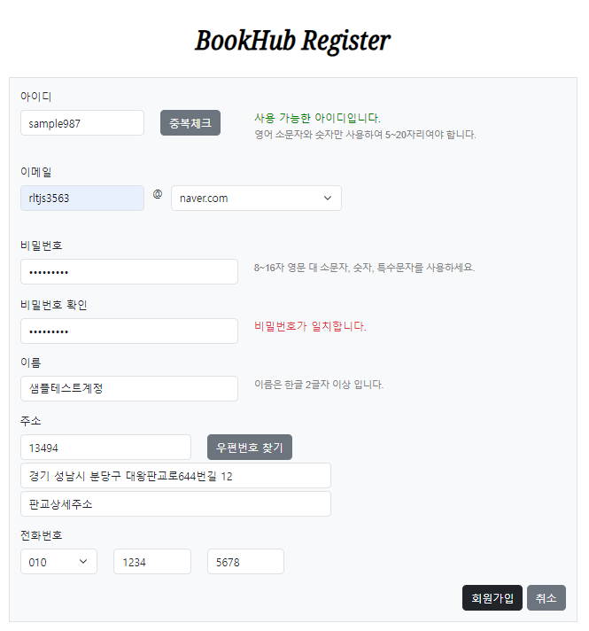  

- ### 회원가입 완료 ,  이메일 전송

  

  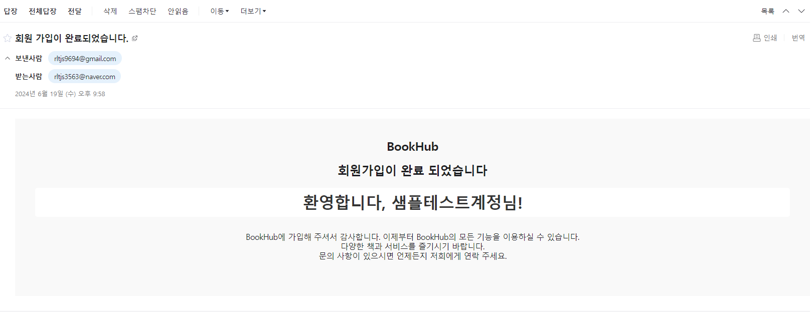

  

- ### 마이페이지
    - 회원정보 조회
  
      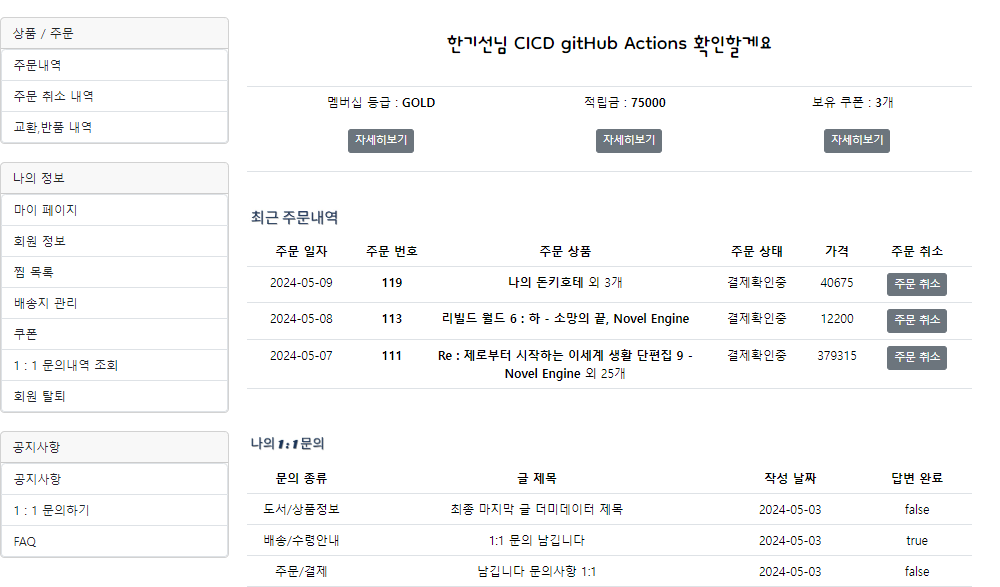
    
     
  
    - 회원정보 수정
  
      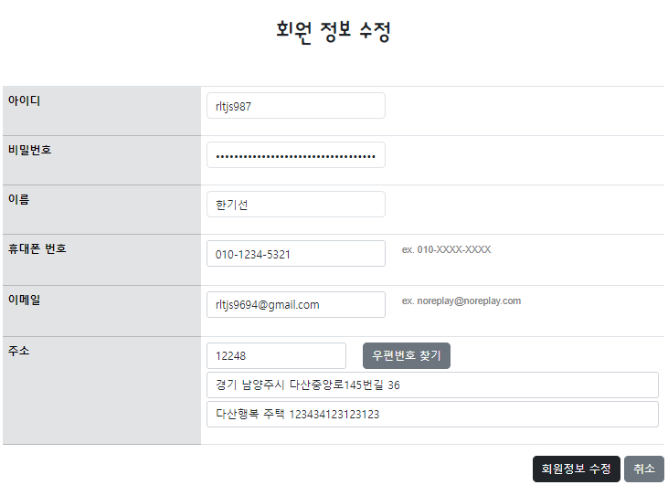

     
  
    - 비밀번호 변경
      - aJax 비동기
      
      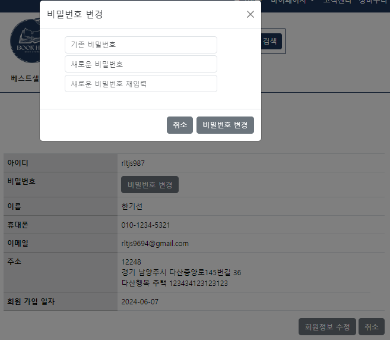
    
     
  
    - 주문 내역 조회

      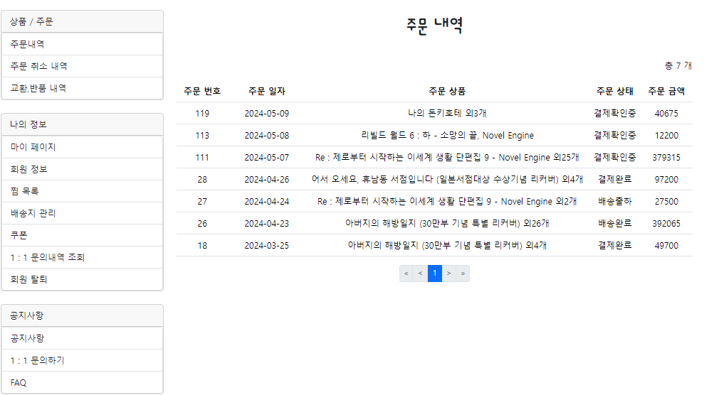
    
     
  
    - 주문 상세 내역 조회
  
       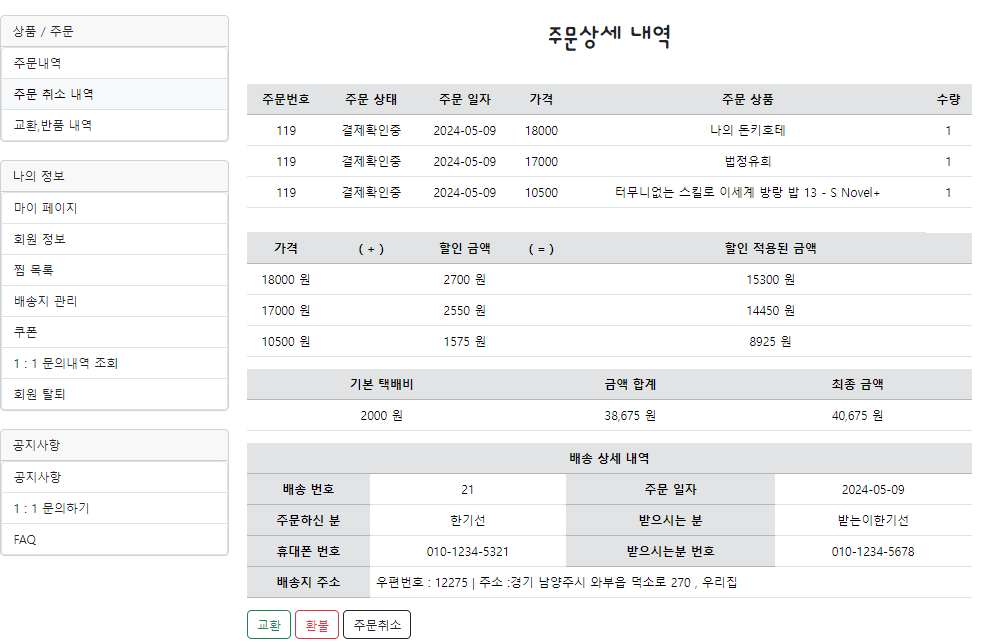
  
     
  
    - 찜 목록
  
      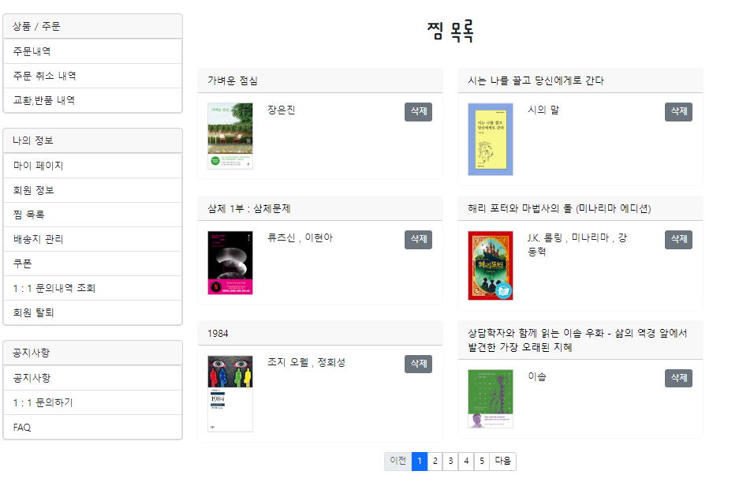
  
     
  
    - 회원 탈퇴
      - 회원 탈퇴시 로그인 불가 처리
      
        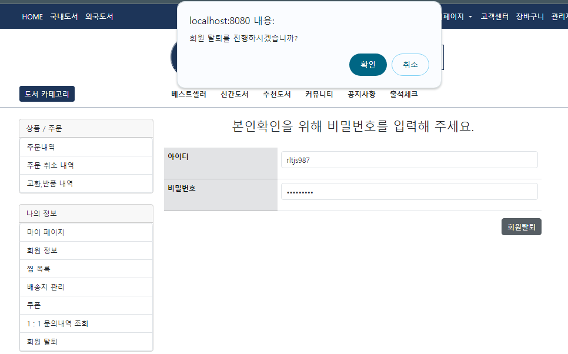

     
  
    - 1 : 1 문의 내역 조회
      - INDEX 조회 성능개선
      
      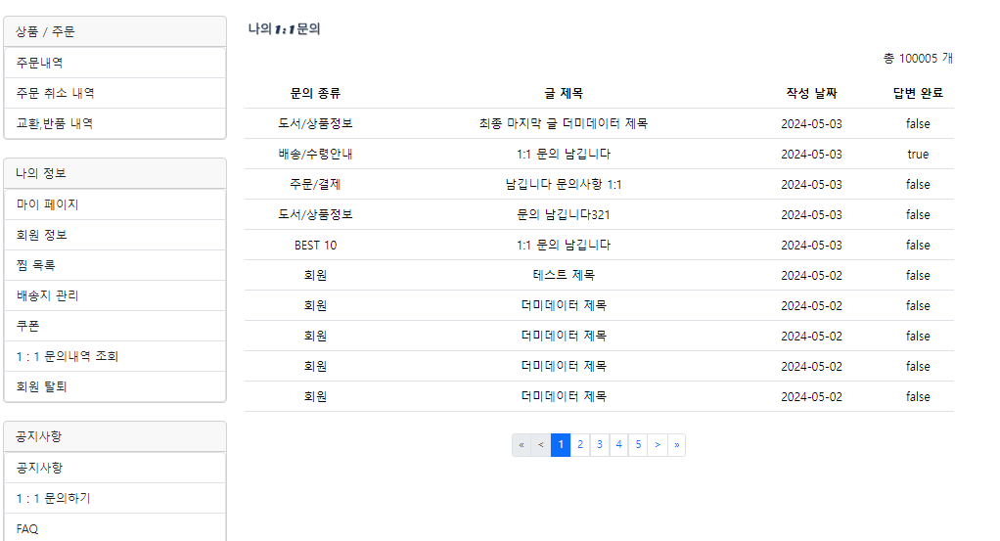 
    
     
  
    - 비밀번호 찾기
      - Regex 에 허용된 임시 비밀번호 생성 
      - 이메일 전송
    
        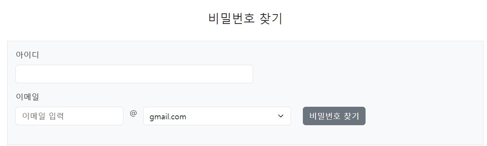

---
