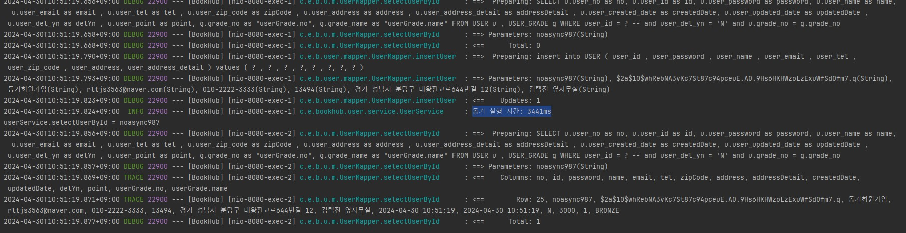
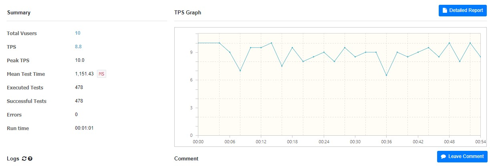
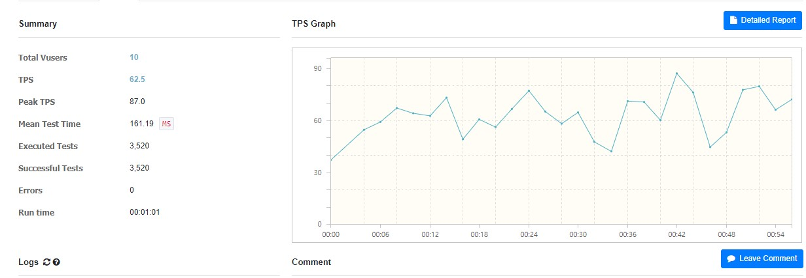

<h2 align="center">📚[ 도서 쇼핑몰 ] BookHub 📚</h2>

 

### 🐥 목차.
- [소개](#소개)
- [기술 스택](#기술-스택)
- [핵심 기능](#핵심-기능)
- [개선 사항](#개선-사항)

-----

 

### 📃 소개 

 

- 도서 쇼핑몰  BOOK HUB
- 프로젝트 기간 : 2024.04.8 ~ 2024.05.16 (39일간 468시간)
- 벤치마킹 사이트 :
  <a href = "https://www.yes24.com/main/default.aspx">  예스24  </a> ,
  <a href = "https://www.kyobobook.co.kr/" > 교보문고  </a>  ,
  <a href = "https://www.aladin.co.kr/home/welcome.aspx"> 알라딘  </a>

   

---

 

### ⚙ 기술 스택 

| 분류      | 기술명                                                        |
|-----------|------------------------------------------------------------|
| BackEnd   | Java, Spring Boot, Spring Security, Junit, MySql , MyBatis |
| FrontEnd  | HTML, Javascript, Bootstrap,  Thymeleaf, jQuery, Ajax      |
| DevOps    | nGrinder, EC2, RDS, S3, CodeDeploy, GithubAction           |
| Tools     | IntelliJ, Gradle                                           |

 

---

 

### 💡 담당 역할 및 기능구현 

- 로그인 / 로그아웃
    - 스프링 시큐리티

- 회원가입
    - Regex 정규표현식
    - @valid 검증
    - 비동기 아이디 중복체크
    - 중복체크 사용자예외처리 클래스
    - 회원가입 완료시 이메일 전송

- 마이페이지
    - 회원정보 조회 , 수정
    - 비동기 비밀번호 변경
    - 주문내역 조회 , 주문상세내역 조회
    - 찜 목록
    - 회원 탈퇴
        - 회원 탈퇴시 로그인 불가 처리
    - 1 : 1 문의 내역 조회
    - 비밀번호 찾기 , 임시비밀번호 생성 및 이메일 전송

 

--- 

 

### 💡 기술적 경험 및 개선사항  

- Master - Slave DB 간의 `Write/Read` 쿼리 분산 [ [코드](https://github.com/gi-dor/BookHub_AWS/blob/30fcb619ad22758e65fe71214f00f1c8ec493e8e/src/main/java/com/example/bookhub/config/DataSourceConfiguration.java#L16-L62) ]
  - @Transactional 의 readOnly 속성을 이용한 쿼리 분산 (@Transactional: 스프링 어노테이션)
  - @RouteDataSource의 dataSourceType 속성을 이용한 쿼리분산

- 중요정보 암호화 처리 [ [ 코드 ](https://github.com/gi-dor/BookHub_AWS/blob/30fcb619ad22758e65fe71214f00f1c8ec493e8e/src/main/java/com/example/bookhub/config/JasyptConfig.java#L16-L35) / [ BLOG ](https://gi-dor.tistory.com/250) ]
  - application.properties에 저장된 DB 연결 정보를 `jasypt` 암호화를 통한 보안강화
  

- 회원 가입 완료시 `비동기 이메일 전송` [ [ 코드 ](https://github.com/gi-dor/BookHub_AWS/blob/30fcb619ad22758e65fe71214f00f1c8ec493e8e/src/main/java/com/example/bookhub/config/AsyncConfig.java#L8-L21) / [ BLOG ](https://gi-dor.tistory.com/255) ]
    - 비동기 처리 이후  `TPS  :  3231ms → 110ms`

  

  
 동기 비동기  전 과 후

   
  <strong>[ 동기 ]</strong>

  
    
  
  <strong>[ 비동기 ]</strong>
  
  

  <strong>[ 성능개선 비교 ]</strong>
  
  

  

- 1:1 문의사항 `INDEX 조회성능 개선`   [  [BLOG](https://gi-dor.tistory.com/252) ]
    - 카디널리티 수치 INDEX 설정
    - 평균 `TPS : 8.8ms  → 62.5ms` 로 610% 개선
    

    
INDEX 전 과 후

     
    <strong> INDEX 적용 전 </strong>
    
    
      
    
    <strong>INDEX 적용 후</strong>
    
    
    
    

  